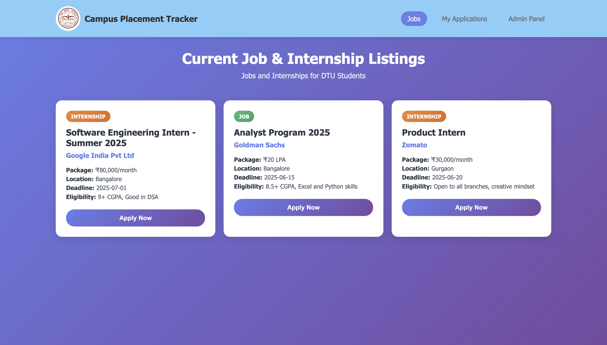
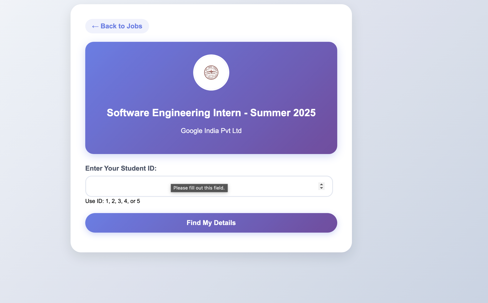
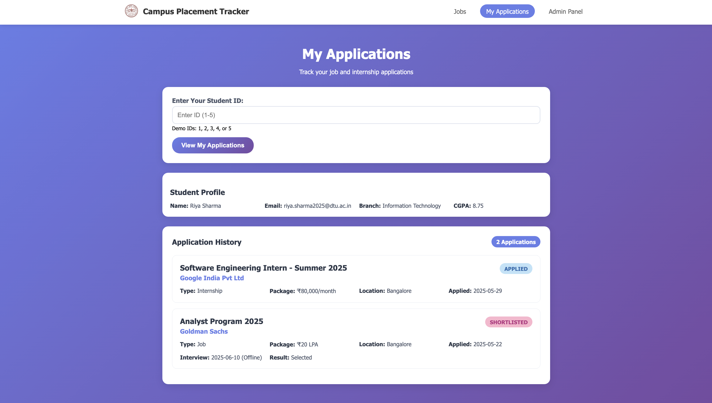

<h1>Student internship and job tracking system </h1>

A web application for managing placement process in universities where companies can post their jobs and internship positions and student can apply for available positions .

<h2>Features</h2>
<ul>
  <li><strong>Job & Internship Listings:</strong> View available opportunities from registered companies</li>
  <li><strong>Student Applications:</strong> Apply directly using your Student ID </li>
  <li><strong>Application Tracking:</strong> Keep track of your application status in real-time</li>
  <li><strong>Admin Panel (Partial):</strong> Placement officers can manage and review applications, and schedule interviews</li>
</ul>
<h2>Tech Stack</h2>

<ul>
  <li><strong>Frontend:</strong> HTML5, CSS3</li>
  <li><strong>Backend:</strong> PHP</li>
  <li><strong>Database:</strong> MySQL</li>
  <li><strong>Development Environment:</strong> XAMPP (Apache, MySQL, phpMyAdmin)</li>
</ul>
<h2>Database Structure</h2>

Main Tables:

<ul>
  <li><strong>Student:</strong> Stores student profiles and academic details</li>
  <li><strong>Company:</strong> Contains information about registered companies and HR contacts</li>
  <li><strong>Job_Internship:</strong> Holds all job/internship postings</li>
  <li><strong>Application:</strong> Tracks applications submitted by students</li>
  <li><strong>Interview:</strong> Manages interview schedules and updates</li>
  <li><strong>Placement_Officer:</strong> Admin details</li>
</ul>

<h2>Usage</h2>
<ul>
<li>Students: Browse jobs → Enter Student ID → Apply → Track status</li>
<li>Admins: Manage applications → Schedule interviews</li>
</ul>

<h2> Screenshots</h2>

<strong>Home Page</strong>

<strong>apply Page</strong>

<strong>my applications page</strong>

<h2>Future Plans</h2>
<ul>
  <li>Complete and secure admin panel</li>
  <li>Automated email notifications for students</li>
  <li>Resume and document upload section</li>
</ul>

Author
Vansh Chopra (23/CS/528)
Delhi Technological University - DBMS Project